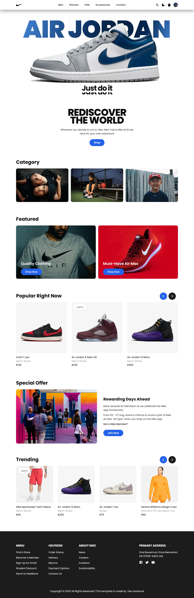

# Nike Webstore

 

## 📃 About the website

Nike Webstore is minimalistic e-commerce website where you can shop for the latest Nike products conveniently online. The platform offers a wide range of Nike shoes, apparel, and accessories for men, women, and kids. Experience seamless shopping and stay updated with the latest trends in sportswear.

## 🌎 Live Website

You can visit the live version of the Nike webstore by clicking the link below 👇

<a href="https://nike-webstores.netlify.app" target="_blank">nike-webstore.netlify.app</a>

## 🧰 Technologies Used

The Nike webstore is built using the following technologies 👇

- Frontend: HTML, CSS/SCSS, JavaScript, React.js
- Backend: Node.js, Express.js
- Database: MongoDB
- Authentication: Clerk Authentication
- Payment Gateway: Stripe

## 📸 Screenshot

## 💻 Features

The Furniq website offers the following features:

- **User-friendly Interface**: Easy navigation and intuitive design for a seamless shopping experience.
- **Product Categories**: Explore a variety of categories including shoes, clothing, and accessories.
- **Product Reviews**: Read and leave product reviews to share your thoughts and experiences with others.
- **Product Details**: View detailed information, prices, and images for each product.
- **User Authentication**: Register and log in securely to manage your account and orders.
- **Shopping Cart**: Add products to your cart and proceed to checkout.
- **Order History**: View your past orders and order statuses.
- **Responsive Design**: Access the website on various devices including desktops, tablets, and smartphones.
